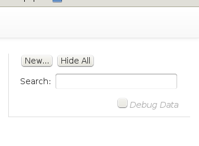
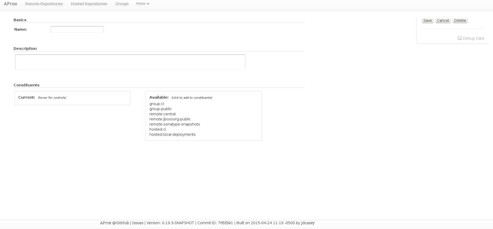

[Back](repos-groups.html) 
[Documentation Contents](index.html)

### Grouping Repositories Together

Most Java developers have encountered that situation when you can't find some artifact you've been reading about and decided to use. You've never had a reason to deviate from the Maven central repository, but for some reason this one artifact just isn't hosted there. What to do?

Using plain vanilla Maven, you could add a repository entry to your settings.xml...but then you have to share your settings.xml with your whole development team. You could also add it to your project (and every other project you develop...or a parent project descriptor).

Or, if you have a repository manager, you can define a new remote repository proxy and add it to the repository group you use for development. A big attraction of this approach is that you de-clutter your settings.xml and pom.xml files. In the case of pom.xml files, you allow them to be source-agnostic, which makes them far less sensitive to changes in remote repository URLs over the long haul (remember that these remote servers are normally outside of your control). Another attraction is that it allows a team to manage the composition of the repository group and another team to focus on developing code.

Another nice thing about repository groups is their ability to partition repository proxies and allow users to reference and manage them abstractly.

All good Maven-ish repository managers offer repository groups, and for the most part they offer approximately the same repository-group features.

### Standard Features

#### Ordered membership

When you request content from a repository group, what happens if a matching artifact exists on two of the member repositories?

If it's an actual artifact file (not a metadata file), the grouping logic should proceed through the membership repositories in order until it finds a match...which it then provides to the user. This means you can affect how artifacts are resolved (and sometimes, how quickly they are resolved) by tuning the membership of your repository group.

#### Metadata and index merging

When you request a metadata file from a repository group (such as the list of available versions for a project), what happens if multiple member repositories contain matching files?

In the case of metadata (not actual artifact content), the content is retrieved from all member repositories with matching files...and merged together. The merged file is then cached (with a timeout) in a storage location for the group, in order to avoid the cost of retrieving and merging the remote content for each request. This means the most relevant result (selected by the user's tooling) can be retrieved from the appropriate member repository seamlessly.

#### Recursive grouping

As mentioned above, repository groups are also handy ways to partition sets of repositories and reference them as aggregate units within the repository manager itself. For example, a build environment might allow two kinds of builds: cleanroom and open. The open builds can resolve artifacts from the Maven central repository and a number of other remote repositories, along with anything that's hosted locally. However, the cleanroom builds should only reference hosted artifacts.

One easy way to handle this situation is to define a repository group that holds all the hosted repositories as members (call it `cleanroom`), and another group which holds all the remote repositories (traditionally called `public`). You can then define another repository group called `open` and include both `cleanroom` and `public` as members. Now you have an easy place to add new remote repositories (`public`) and another easy place to add new hosted repositories (`cleanroom`). Artifacts available from the `open` group will be adjusted automatically.

You can then point cleanroom builds to use the `cleanroom` repository group URL, and open builds to use the `open` group URL.

### Extra Features

#### Merged (remote) directory listings

Just as AProx provides a means of browsing the content of remote repositories, it also provides merged directory listings for repository groups. These merged listings include remote content that hasn't been cached yet along with content that it hosts or has cached. Additionally, hovering over any entry in a directory listing will provide information about what specific repositories in the group contains that listing entry. In the case of directories, this information could list multiple member repositories.

### How to Setup a Repository Group

Click on the `Groups` menu item at the top.

  

Click on the `New...` button on the right.

  

Fill out the details of the group. The minimum information is the name. 

  

Note that you can add group members by clicking on entries in the `Available` panel:

  

If you have multiple members, you can change their order by hovering over a member and clicking the appropriate arrow (or `X` to remove from the group):

  

Once you're finished, click the `Save` button on the right, and add a changelog entry:

  

Click `Save` again to store your changes in a Git file revision containing the changelog as its message.
