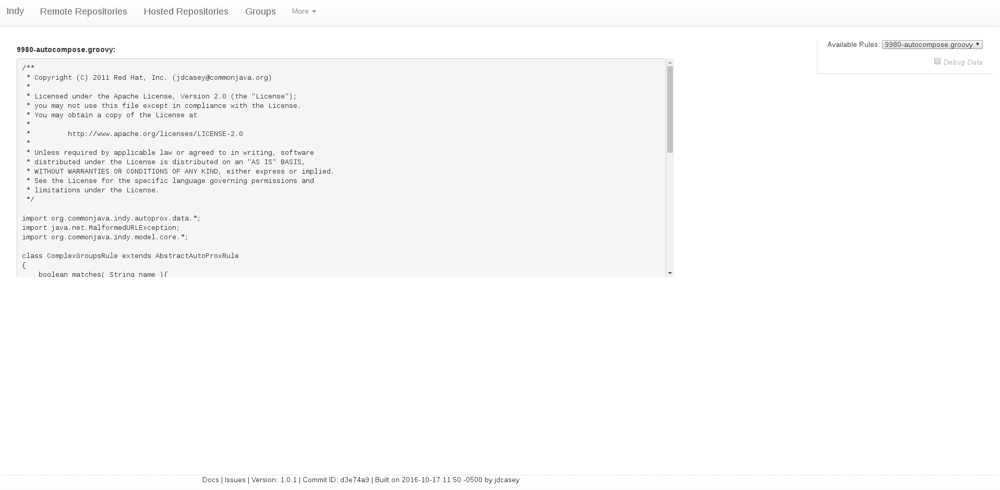
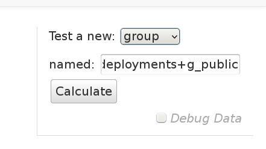
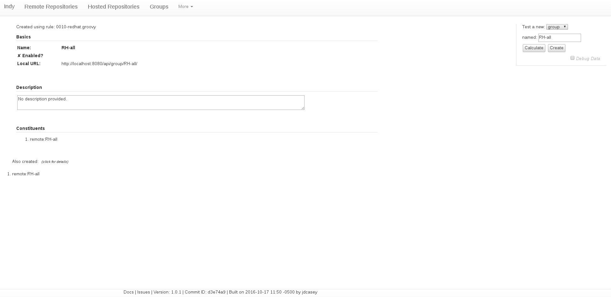
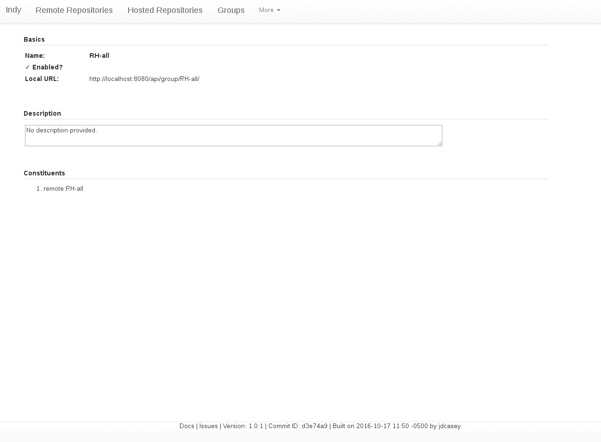

### Less Ho-Hum, More Humming Along

If you're running a repository manager to support a continuous integration system, you're probably setting up vast quantities of the same kind of repository over and over for new sets of projects. 

It's common enough when multiple codebases are developed in concert: You need to get your CI builds up and running, but building one project depend on snapshots resulting from the build of another project. If you want your project sets to be reasonably insulated from other development work going on, you might need to control where non-snapshot artifacts are coming from, too. Maybe you're part of a QE team that wants to test proposed releases in the context of a strictly controlled set of other artifact stores (repositories and groups), and not allow product versions (proposed or released) to cross-contaminate. 

Or, maybe you just want to ensure that repositories created with a given naming scheme have certain content timeouts, authentication information, or proxy configuration.

If any of this sounds familiar, you could probably benefit from the Autoprox add-on. This add-on allows you to write store-creation templates (also called rules), using Groovy, that match particular repository naming patterns. When matched, a template is invoked to create the appropriate store type and in the case of remote repositories, a validation URL (to ensure the repository has a chance of working). By developing one or two of these templates, you can avoid the drudgery and risk of human error involved with creating dozens or hundreds of new repository-resolution environments.

Any request for a non-existent repository or group will trigger Autoprox to try to auto-create the corresponding store. This means you can configure Maven (or some other tool) to use a repository that doesn't exist yet, and AProx will create - and then use - it automatically when you run your build. If you use Autoprox templates in conjunction with the [DotMaven Add-On](dot-maven-addon.html), any attempt to access the auto-generated settings.xml file corresponding to a non-existent store will trigger its creation, then use it to generate the appropriate settings.xml for use with it.

### Writing Templates

All Autoprox templates must implement [org.commonjava.aprox.autoprox.data.AutoProxRule](https://github.com/Commonjava/aprox/blob/master/addons/autoprox/common/src/main/java/org/commonjava/aprox/autoprox/data/AutoProxRule.java). But normally it's much simpler to extend [org.commonjava.aprox.autoprox.data.AbstractAutoProxRule](https://github.com/Commonjava/aprox/blob/master/addons/autoprox/common/src/main/java/org/commonjava/aprox/autoprox/data/AbstractAutoProxRule.java) instead, since it allows you to implement only the behavior you're interested in.

For example, if you wanted to create a rule where any request to a remote repository named `CI-<name>` points to a corresponding remote URL `http://www.foo.com/<name>/repository` you could simply implement the name matcher and the remote repository creation rule:

    import org.commonjava.aprox.autoprox.data.*;
    import org.commonjava.aprox.model.core.*;
    import java.net.MalformedURLException;
    
    class CIRule extends AbstractAutoProxRule
    {
        boolean matches( String name ){
            name.startsWith( "CI-" )
        }
    
        RemoteRepository createRemoteRepository( String named )
            throws MalformedURLException
        {
            def match = (named =~ /CI-(.+))[0]
            def remoteName = match[1]
            new RemoteRepository( 
                  name: named, 
                  url: "http://www.foo.com/${remoteName}/repository/" )
        }
    }

If you want to support creation of groups that include a few remote repositories as well, you can add that:

    Group createGroup( String named )
    {
        Group g = new Group( named );
        g.addConstituent( new StoreKey( StoreType.remote, named ) )
        g.addConstituent( new StoreKey( StoreType.remote, "central" ) )
        g.addConstituent( new StoreKey( StoreType.remote, "jboss.org" ) )
        g.addConstituent( new StoreKey( StoreType.hosted, 
                                        "released-products" ) )
        
        g
    }

Or, for CI operations it can be especially useful to also create a hosted repository to hold snapshots for related projects to depend on. In this case, you probably want to add a hosted repository to the top of the group constituent list:

        g.addConstituent( new StoreKey( StoreType.hosted, name ) )

Then, you'd implement the `createHostedRepository(..)` method:

        HostedRepository createHostedRepository( String named )
            throws MalformedURLException
        {
            h = new HostedRepository( name: named )
            h.setAllowSnapshots( true )
            h.setAllowReleases( false )
            
            def oneWeek = 7 * 24 * 60 * 60
            h.setSnapshotTimeoutSeconds( oneWeek )
            
            h
        }

### Order of Operations

If you have two templates that match on overlapping name patterns, you can use the template file name to introduce an order of operations to the template-matching process. Autoprox will iterate through its available templates in order, so naming rules like this avoids any question about which template will be used:

    0001-CI.groovy
    0010-FOO.groovy
    9980-autocompose.groovy

### Auto-Composed Groups

In the above template listing, you probably noticed a file called `9980-autocompose.groovy`. This template is included with Autoprox by default, and covers a somewhat unique case.

In most situations where Autoprox makes sense, you'll be able to cover a large majority of your store-creation needs using templates. But there will always be those times when you need something special; some composition of repositories and groups that is an outlier situation. If you're able to administer AProx, you can just add these new groups and make the composition whatever it needs to be, without involving Autoprox at all.

However, if you want to provide a self-service option for developers, you can use the autocompose template. This template only supports creation of groups, and matches any name of the form:

    [g|r|h]_<name>+[g|r|h]_name...

The group name is actually a `+`-delimited list of repositories and groups which should be members of the new group, and the their ordering in the group name determines the membership ordering. Each segment in the group name consists of a prefix character `[g|r|h]` determines what store type that segment references (group, hosted repository, or remote repository). Then comes an underscore (`_`) to separate the prefix from the store name, and finally the store name itself.

While the name winds up being pretty ugly, especially for groups with large memberships, it's an effective way to create groups with flexible membership on-demand. The template implementation is actually quite simple:

    import org.commonjava.aprox.autoprox.data.*;
    import org.commonjava.aprox.model.core.*;
    import java.net.MalformedURLException;
    
    class ComplexGroupsRule extends AbstractAutoProxRule
    {
        boolean matches( String name ){
            name =~ /.+\+.+/
        }
    
        Group createGroup( String named )
        {
            String[] parts = named.split("\\+")
            
            Group g = null
            if ( parts.length > 1 ){
                g = new Group( named )
                parts.each{
                  int idx = it.indexOf('_')
                  
                  String type = 'remote'
                  String name = null
                  if ( idx < 1 ){
                    name = it
                  }
                  else{
                    type = it.substring(0,idx)
                    name = it.substring(idx+1)
                  }
                  
                  g.addConstituent( new StoreKey( StoreType.get( type ), 
                                    name ) );
                }
            }
            
            g
        }
    }

For example, if I wanted to auto-create a group that pointed at:

1. `hosted:local-deployments` (a hosted repository created by default with AProx)
2. `remote:central` (the Maven central repository)
3. `remote:jboss.org` (a remote repository pointing at JBoss.org's public repository)

I could use the request path:

    /api/group/h_local-deployments+r_central+r_jboss.org/...

Or, if you have a stricter HTTP client, you might need to encode the URL path to:

    /api/group/h_local-deployments%2Br_central%2Br_jboss.org/...

Again, it's not the prettiest URL, but it requires zero administration to create. You simply have to point your tooling at it and try to use it.

### Referencing Non-Existent Stores

It's worth mentioning separately that if one of your rules creates a group that references a non-existent store, Autoprox will try to create the referenced store using one of its templates before storing the group. In this way, you can create multiple, simple templates that work together to define complex artifact-resolution environments without having a nest of complex logic to maintain.

### Custom Validation for Remote Repositories

By default, Autoprox will use a HTTP HEAD request to the root URL of any remote repository created by a template before storing it, just to ensure that the remote location is available. In some cases, this root URL may not respond correctly, especially if the repository contains a large set of directories at the root level. Or, you might need to perform validation with some sort of altered characteristics that you don't want to use permanently.

To handle this case, Autoprox allows templates to define the method `createValiationRemote(..)`. If we take our CI example above, we might use an alternative URL for validation, like this:

        RemoteRepository createValidationRemote( String name )
        throws AutoProxRuleException, MalformedURLException
        {
            def match = (named =~ /CI-(.+))[0]
            def remoteName = match[1]
            new RemoteRepository( 
                    name: "validate-${named}", 
                    url: "http://status.foo.com/${remoteName}/" )
        }

### A Word of Caution: Typos Can Kill

You have probably noticed the Achilles heel of Autoprox by now: it has the ability to create repositories and groups, but it cannot delete them. If two developers try to reference the same repository, but one mistypes the name, Autoprox could conceivably create two repositories. If you're using a complex suite of templates, they might create two large sets of repositories and groups! 

This can create enough cleanup work to completely erase the time advantage of using Autoprox in the first place, so be careful!

### Clients and UI

Most of the real work done by Autoprox is automatic, and decorates existing functionality. However, there are some client-side features that make it a little easier to work with this add-on.

#### Rule Browser

In most deployments, it won't be all that simple to login to the AProx server and inspect your Autoprox templates directly. While you can get your own copy - and even branch and modify them - if you're using the [Revisions Data-Versioning Add-On](revisions-addon.html), it's often simpler to just go look at the templates (aka rules) through your AProx web UI's Autoprox Rule Browser, located under the `More > AutoProx Rules` menu at the top.

The rule browser gives you a selectable view of all the templates available on your AProx instance. Currently, this feature is restricted to read-only access, but a full CRUD-enabled version is [planned](https://github.com/Commonjava/aprox/issues/120).

#### Autoprox Calculator

Whenever you have string-matching of any sort, it's a good idea to have some way to validate your match patterns. In the case of Autoprox, this is even more important, since group creation can trigger further repository (or even group!) creation and result in multiple new repositories and groups being created. If template name-matching logic can be very similar or even overlap, it's nice to have a way to see Autoprox in action without actually creating anything.

To help users understand how their templates are actually used, Autoprox adds a calculator function to the web UI. The Autoprox Calculator is located under `More > AutoProx Calculator` menu at the top.

The first thing you'll be presented with in this calculator is its control panel, on the right. You can select what type of store you want to test, and enter the name you want to check.

Having entered this information, the next step is to click `Calculate`. If one of your templates matched on the name given and returned a non-null result, that result will be displayed. Otherwise, you'll get a message saying `Nothing was created`.

If you're testing group creation, you might see something like this:

If the creation of that group would trigger any further groups or repositories to be created, those are listed at the bottom. If you want to see details about these additional stores, you can click on each of these to expand them:

From here, you have the option to create the resulting structure using the `Create` button. This functions as a sort of save button for the tested store name, and will have the same effect as if you had simply started using a URL to that store name. Autoprox will create the stores, and they will be available for immediate use.

#### Getting Started: Apache Maven

If you use Apache Maven, you'll need the following dependencies in order to use the Java client API for this add-on:

    <!-- The core of the AProx client API -->
    <dependency>
      <groupId>org.commonjava.aprox</groupId>
      <artifactId>aprox-client-core-java</artifactId>
      <version>${aproxVersion}</version>
    </dependency>
    <!-- AProx client API module for autoprox -->
    <dependency>
      <groupId>org.commonjava.aprox</groupId>
      <artifactId>aprox-autoprox-client-java</artifactId>
      <version>${aproxVersion}</version>
    </dependency>

#### Administering Rules

While not yet available via the web UI, the REST and Java client APIs both support management of Autoprox template files (rules). You have full CRUD + listing access via these apis.

For example, here is a snippet written in Java that verifies creation and deletion of a rule remotely. It also uses listing to verify an initially empty rule set, and retrieval by name to verify deletion:

    AutoProxCatalogModule module = new AutoProxCatalogModule();
    Aprox aprox = new Aprox( 
        "http://localhost:8080/api/", 
        new AproxObjectMapper(), module ).connect();
    
    final CatalogDTO catalog = module.getCatalog();
    assertThat( catalog.isEnabled(), equalTo( true ) );
    assertThat( catalog.getRules()
                        .isEmpty(), equalTo( true ) );
    
    String src = "rules/simple-rule.groovy";
    final URL resource = Thread.currentThread()
                                .getContextClassLoader()
                                .getResource( src );
    if ( resource == null )
    {
        Assert.fail( "Cannot find classpath resource: " + src );
    }
    
    final String spec = IOUtils.toString( resource );
    RuleDTO dto = new RuleDTO( "0001-simple-rule", spec );
    dto = module.storeRule( rule );
    
    assertThat( dto, notNullValue() );
    assertThat( dto, equalTo( rule ) );
    
    module.deleteRuleNamed( dto.getName() );
    
    dto = module.getRuleNamed( dto.getName() );
    
    assertThat( dto, nullValue() );
    
    IOUtils.closeQuietly( aprox );

#### Further Java Examples

For more examples of using the Java client API to access Autoprox functions, check out the [Autoprox functional tests](https://github.com/Commonjava/aprox/tree/master/addons/autoprox/ftests/src/main/java/org/commonjava/aprox/autoprox/ftest).

