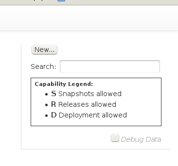
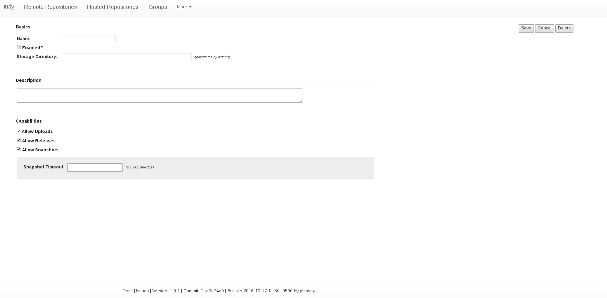
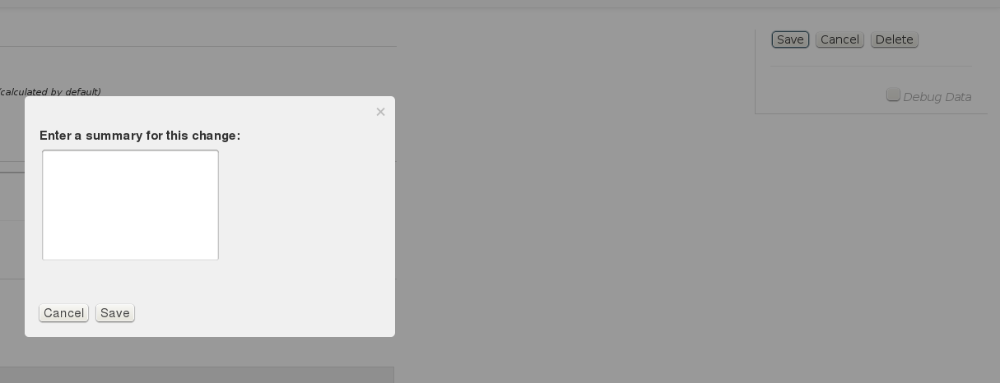

[Back](repos-groups.html) 
[Documentation Contents](index.html)

### Hosting Deployed Artifacts

If you produce software that isn't always available to the public, or you have a development process that includes continuous integration and you use snapshot builds, then you need someplace to park your artifacts. This place needs to be accessible to other Maven-ish builds (otherwise what's the point?) and ideally, it should be easy to push artifacts up to it with minimal configuration of your build tooling.

This is what hosted repositories were designed to handle. Hosted repositories normally allow build tools to use HTTP PUT to push new artifacts up into storage, and will serve them via a normal HTTP GET, just like any other type of repository. While there isn't a lot to distinguish one repository manager from another when it comes to hosting artifacts, it's still useful to talk about the "standard" form of hosting and the little extras that Indy provides.

### Standard Features

#### Hosting release and snapshot artifacts

As mentioned above, repository managers are expected to host build artifacts, both releases with concrete versions and snapshots using the virtual \*-SNAPSHOT version. This means supporting HTTP PUT access to add new artifacts and HTTP GET access to retrieve artifacts (for example, during a build).

It also means maintaining accurate artifact metadata, such as the list of versions deployed to that hosted repository and the list of uniquely-versioned snapshot artifacts stored within a \*-SNAPSHOT directory. Maven (and other tools) require this metadata whenever they have to resolve version ranges or other ambiguous scenarios during a build.

#### Storage timeout for snapshots

When storing snapshot artifacts, storage often becomes a problem. It's tempting to run CI systems almost, well, continously when doing active development. If projects depend on one another, you need to use a repository manager to host the CI output so other CI jobs can depend on updated artifacts. Over time, snapshot directories bloat severely with obsolete artifacts.

To address this, most repository managers provide at least one way to cull obsolete snapshot artifacts. The most basic uses a snapshot timeout, which removes the snapshot after some period expires. Accessing the artifact resets this timeout.

### Extra Features

#### Combined release / snapshot storage in a single repository

When doing large-scale deployment of a typical repository manager - especially in a CI environment - you will often find that you're setting up the same three repositories over and over again:

* One for hosting releases in the CI group
* One for hosting snapshots in the CI group
* One repository group to tie the hosted repositories together with public repository proxies and provide a single URL for resolving artifacts

Indy simplifies this a bit by allowing you to configure hosted repositories to store release artifacts, snapshot artifacts, or **both**. It's not enough to completely eliminate this tedium (check out the [Autoprox add-on](autoprox.html) to completely eliminate this tedium), but in these environments every little bit can help.

#### Flexible storage locations (directories)

Perhaps you have filled your disk with proxied remote artifacts. Perhaps you need a RAID array to host your new hotness and make sure nothing happens to it. Perhaps you've got a networked filesystem and a ton of Indy instances around the globe that all share the same hosted artifacts. Perhaps for *some* of your hosted repositories, you want to make sure their content is as safe as safe can be, for the next 10 years or more...while for others, their content could go up in a puff of smoke tomorrow without prompting much more than a slight shrug.

There are any number of reasons why you might need to specify where you store hosted artifacts. With Indy, you can configure each hosted repository to store its artifacts on a different disk if you want to.

### How to Setup a Hosted Repository

Click on the `Hosted Repositories` menu item at the top.

  

Click on the `New...` button on the right.

  

Fill out the details of the hosted repository. The minimum information is the name. 

  

Once you're finished, click the `Save` button on the right, and add a changelog entry:

  

Click `Save` again to store your changes in a Git file revision containing the changelog as its message.
